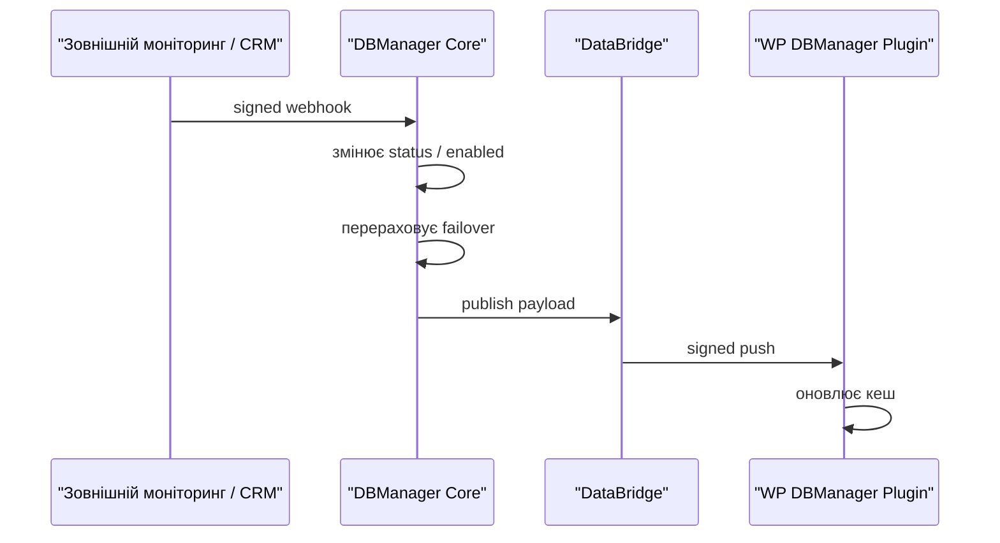

# DBManager — dbm-api

Пов'язано: [[DBManager — Огляд]]

Цей документ описує, як зовнішня система моніторингу або CRM може повідомити центральний DBManager Core, що номер або месенджер упав чи знову доступний. Core після такого сигналу перераховує failover, публікує новий payload у DataBridge, а Bridge доставляє оновлення у WordPress-плагіни.

## Базова схема



## Авторизація

Усі зовнішні виклики мають бути підписані HMAC-SHA256.

Секрет живе тільки у `.env` Core:

```env
MONITORING_WEBHOOK_SECRET=...
```

Заголовки:

```http
Content-Type: application/json
Accept: application/json
X-Signature: <hmac-sha256(raw-json-body, MONITORING_WEBHOOK_SECRET)>
```

Важливо: підпис рахується від сирого тіла запиту рівно в тому вигляді, в якому воно відправляється. Не можна рахувати підпис від pretty-printed JSON, а надсилати minified JSON.

## Реалізовано зараз: падіння номера

Endpoint:

```http
POST /api/monitoring/numbers
```

Тіло запиту:

```json
{
  "e164": "+380441112233",
  "status": "down"
}
```

Поля:

| Поле | Тип | Обов'язково | Опис |
|---|---:|---:|---|
| `e164` | string | так | Номер у форматі E.164. Має існувати в `phone_numbers.e164`. |
| `status` | string | так | `down` або `active`. |

Поведінка:

- `down` переводить `phone_numbers.status` у `down`, ставить `down_since`, перераховує всі слоти, де використовується цей номер.
- `active` повертає номер у `active`, очищає `down_since`, перераховує всі пов'язані слоти.
- Якщо видимий номер у слоті змінився, Core створює audit-запис і публікує нову версію payload для всіх зачеплених сайтів.
- Bridge має мати запущений `bridge-worker`, інакше payload залишиться в черзі й не дійде до плагіна.

Успішна відповідь:

```json
{
  "affected_sites": 1
}
```

Можливі відповіді:

| HTTP | Коли |
|---:|---|
| `200` | Сигнал прийнято. |
| `401` | Невірний `X-Signature`. |
| `422` | Невідомий номер або невалідне тіло запиту. |
| `429` | Перевищено throttle `60/min`. |
| `500` | Не налаштовано `MONITORING_WEBHOOK_SECRET`. |

### Приклад curl

```bash
body='{"e164":"+380441112233","status":"down"}'
sig=$(printf '%s' "$body" | openssl dgst -sha256 -hmac "$MONITORING_WEBHOOK_SECRET" -binary | xxd -p -c 256)

curl -X POST "https://core.example.com/api/monitoring/numbers" \
  -H "Content-Type: application/json" \
  -H "Accept: application/json" \
  -H "X-Signature: $sig" \
  --data "$body"
```

### Приклад PHP

```php
$body = json_encode([
    'e164' => '+380441112233',
    'status' => 'down',
], JSON_UNESCAPED_SLASHES);

$signature = hash_hmac('sha256', $body, getenv('MONITORING_WEBHOOK_SECRET'));
```

## Контракт для реалізації: падіння месенджера

На дату `2026-06-19` у Core реалізований зовнішній endpoint тільки для номерів. Для месенджерів рекомендований контракт нижче. Його варто реалізувати окремим контролером, щоб зовнішні інтегратори одразу мали стабільний API.

Endpoint:

```http
POST /api/monitoring/messengers
```

Тіло запиту для конкретного месенджера:

```json
{
  "site": "domen.ua",
  "messenger_key": "telegram_support_1",
  "status": "down"
}
```

Альтернатива для слота месенджера:

```json
{
  "site": "domen.ua",
  "slot_key": "support",
  "messenger_key": "telegram_support_1",
  "status": "active"
}
```

Поля:

| Поле | Тип | Обов'язково | Опис |
|---|---:|---:|---|
| `site` | string | так | Домен сайту з таблиці `sites.domain`. Потрібен, щоб не зачепити однакові ключі на інших сайтах. |
| `messenger_key` | string | так | Точний `data_values.key` конкретного месенджера або резерву. |
| `slot_key` | string | ні | Логічний слот месенджера: `content.messenger_slot` або ключ основного месенджера. |
| `status` | string | так | `down` або `active`. |
| `reason` | string | ні | Діагностична причина для audit-log. |

Рекомендована поведінка реалізації:

- `down` встановлює `content.enabled = false` для конкретного `messenger_key`.
- `active` встановлює `content.enabled = true`.
- Поточний месенджер у слоті обирається так само, як у payload-компіляторі: pinned → sticky current → перший активний enabled.
- Якщо всі месенджери слота недоступні, використовується `exhaustion_policy`: `hide`, `last` або `emergency`.
- Після зміни Core публікує payload для сайту, а Bridge доставляє його в плагін.

Успішна відповідь:

```json
{
  "affected_sites": 1,
  "affected_messengers": 1
}
```

Можливі відповіді:

| HTTP | Коли |
|---:|---|
| `200` | Сигнал прийнято. |
| `401` | Невірний `X-Signature`. |
| `404` | Сайт або месенджер не знайдено. |
| `422` | Невалідне тіло запиту. |
| `429` | Перевищено throttle. |

## Вимоги до безпеки

- Не передавати секрети в query string.
- Не логувати `MONITORING_WEBHOOK_SECRET` або повний `X-Signature`.
- Обмежити доступ до endpoint-ів за IP allowlist на reverse proxy, якщо це можливо.
- Для нового messenger endpoint бажано додати `X-Timestamp` і перевірку вікна 5 хвилин, щоб зменшити ризик replay-атак.
- Усі прямі SQL-оновлення ззовні небажані: якщо зміна обходить Core API, треба окремо запускати публікацію payload.

## Перевірка після виклику

1. У відповіді Core перевірити `affected_sites`.
2. У Bridge перевірити, що `jobs = 0` і `failed_jobs = 0`.
3. У WordPress-плагіні перевірити версію кешу на сторінці `DBManager → Дані`.
4. Якщо дані не дійшли, спершу перевірити `bridge-worker`: без нього Bridge приймає payload, але не доставляє його в плагін.
