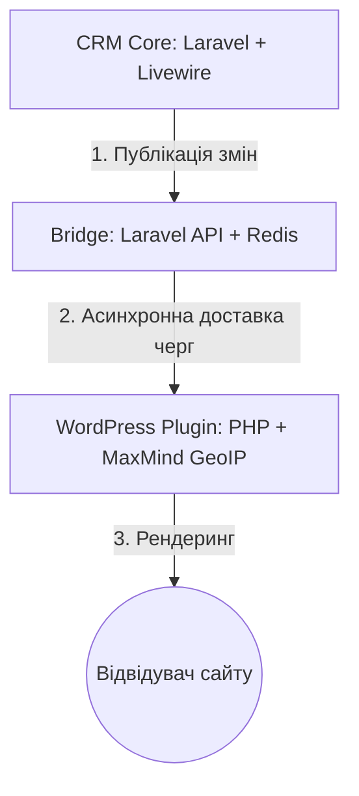

# DBManager — Презентація та архітектура системи

Централізована система керування контентом (телефони, месенджери, ціни) для мережі сайтів з автоматичною доставкою кешу та локальним GeoIP-детектом.

---

## 🎯 1. Мета системи

Головна мета **DBManager** — вирішити проблему хаотичного оновлення контактних телефонів, активних месенджерів та цін на сотнях підконтрольних сайтів.

### Основні бізнес-можливості:
1. **Єдине вікно керування**: Усі телефони, месенджери та ціни додаються та редагуються виключно в одному місці — центральній CRM Core.
2. **Розподіл за сайтами та ГЕО**: Кожен сайт бачить лише свій набір даних. Кожен відвідувач бачить контент, що відповідає його країні (наприклад, ціну для України, Румунії чи загальну світову ціну WORLD).
3. **Висока швидкість та автономність**: Сайти не роблять HTTP-запитів до бази даних під час завантаження сторінок користувачами. Всі дані зчитуються миттєво з локального кешу WordPress.
4. **Аварійна стійкість (Fallback)**: Навіть якщо плагін повністю видалити з адмінки, спеціальний фолбек-компонент у `mu-plugins` продовжує відображати телефони та ціни з кешу без збоїв у верстці сайту.

---

## 🛠️ 2. Технологічний стек

Система розділена на 3 незалежні компоненти, що взаємодіють через API:

### 1. CRM Core (Панель керування)
- **Технології**: PHP 8.4, Laravel, Livewire, Alpine.js, MySQL.
- **Роль**: Створення та групування цін/телефонів, прив'язка сайтів, генерація токенів доступу, формування контент-пакетів для публікації.

### 2. Bridge (Асинхронний транспортний міст)
- **Технології**: PHP 8.4, Laravel API, Redis (Laravel Queue), MySQL.
- **Роль**: Приймання запитів публікації від Core, додавання завдань у чергу Redis, паралельне розсилання оновлень на кінцеві сайти, обробка помилок доставки та логування статусів.

### 3. WordPress Plugin (Клієнтський плагін)
- **Технології**: Pure PHP, MaxMind GeoLite2 Country (бінарна локальна БД IP-адрес), jQuery (в адмінці).
- **Роль**: Приймання підписаних оновлень, збереження їх у локальний кеш (`wp_options`), локальний GeoIP-детект країни користувача без зовнішніх запитів, рендеринг шорткодів.

---

## 🔒 3. Безпека системи

Безпека є ключовим пріоритетом архітектури DBManager, оскільки злам одного сайту не повинен компрометувати центральну базу даних.

### Ключові принципи захисту:
1. **Пасивний режим сайтів (Push-only)**:
   Сайти WordPress працюють як пасивні слухачі. Вони **ніколи** самі не звертаються до CRM Core і навіть не знають її URL-адреси. Зловмисник, зламавши сайт, не зможе знайти адресу CRM чи отримати доступ до інших сайтів.
2. **HMAC-SHA256 Підписи**:
   Кожне оновлення, яке надсилається з Bridge до плагіна, підписується унікальним секретним ключем (`signing_secret`), що генерується для кожного сайту індивідуально. Плагін перевіряє підпис кожного запиту. Підробити дані без знання секретного ключа неможливо.
3. **Локальний GeoIP-детект**:
   Плагін визначає країну відвідувача за допомогою локальної бінарної бази даних MaxMind, завантаженої прямо на сайт. Жодні IP-адреси відвідувачів не передаються на зовнішні сервери чи API, що гарантує 100% відповідність вимогам GDPR та конфіденційності.
4. **Невидимість сервісних папок**:
   Усі технічні дані та кеші повністю приховані від індексації пошуковими системами та Obsidian-графу.

---

## ⚙️ 4. Можливості вставки та кастомізації

Плагін надає зручні інструменти для інтеграції та адаптації контенту під дизайн сайту:

- **Гнучкі шорткоди**:
  - `[dbm key="phone_1"]` — виведення чистого значення.
  - `[dbm_phone_block key="phone_1"]` — блок телефону з кнопками його месенджерів.
  - `[dbm_price key="price_ro"]` — універсальний слот ціни, який сам покаже потрібну ціну для країни відвідувача.
- **Кастомізація**:
  - Можливість завантажити власні іконки месенджерів (Viber, Telegram тощо) через медіабібліотеку WordPress.
  - Додавання довільних CSS-класів на елементи (блоки телефонів, посилання месенджерів та теги цін) для інтеграції у будь-які теми та конструктори (Elementor, Divi тощо).
