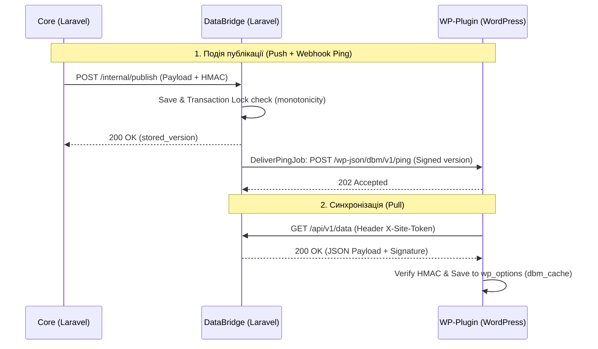

# Специфікація та робота WP-Plugin в реальних умовах

**Дата створення:** 2026-06-19
**Модель аудиту:** Gemini (Advanced Agentic Coding)

Цей документ описує принципи роботи, архітектуру синхронізації та логіку рендеру WordPress плагіна **DBManager** на основі аналізу його кодової бази.

---

## 1. Функціональні складові плагіна

### 1.1. Рендер телефонів, месенджерів та цін
Уся логіка відображення зосереджена у файлі [render-core.php](file:///c:/Dev/Meweek/10-Projects/DBManager/code/plugin/shared/render-core.php) та інтегрована через клас [Plugin.php](file:///c:/Dev/Meweek/10-Projects/DBManager/code/plugin/dbmanager/src/Wp/Plugin.php).
- **Телефони (`phone`)**:
  - Відображаються у форматі посилання `<a href="tel:...">...</a>` за умови виклику з опцією `format => 'tel'`.
  - Failover-ротація (наприклад, перемикання на резервний номер при вичерпанні лімітів або блокуванні основного) координується **централізовано на стороні Core**. Плагін отримує вже розрахований Core актуальний номер та його поточний стан (`ok`, `hidden`, `exhausted`).
- **Месенджери (`messenger`)**:
  - Рендеряться як посилання `<a href="{url}">{value}</a>` при `format => 'link'`.
  - Стан месенджера (`ok`, `on_reserve`, `hidden`, `exhausted`) визначає його видимість. Якщо стан `hidden` або `exhausted` (без аварійного номера) — плагін повертає порожній рядок.
- **Ціни (`price`)**:
  - Ціни інтегровано як слоти (наприклад, `ROMANIA`). SitePayloadCompiler розгортає слоти у плоскі елементи з географічними мітками.
  - Рендер повертає текстове представлення ціни (значення `value` та лейбл `label`), відфільтроване за країною користувача.

### 1.2. Географічний пріоритет (Geo-Priority)
Гео-визначення виконується один раз за HTTP-запит при ініціалізації шорткоду в [Plugin.php](file:///c:/Dev/Meweek/10-Projects/DBManager/code/plugin/dbmanager/src/Wp/Plugin.php#L88):
1. **Cloudflare header**: Перевіряється заголовок `CF-IPCountry`. Якщо він містить валідний код країни (наприклад, `UA`, `RO`), плагін використовує його.
2. **Локальний GeoIP**: Якщо заголовка від Cloudflare немає, виконується пошук IP-адреси відвідувача (`CF-Connecting-IP` або `REMOTE_ADDR`) у локальній MaxMind базі даних через клас [MaxMindCountryLookup.php](file:///c:/Dev/Meweek/10-Projects/DBManager/code/plugin/dbmanager/src/Geo/MaxMindCountryLookup.php).
3. **WORLD fallback**: Якщо країну не вдалося визначити, використовується глобальний скоуп `WORLD`.
4. **Рендеринг**: [render-core.php](file:///c:/Dev/Meweek/10-Projects/DBManager/code/plugin/shared/render-core.php#L17) шукає значення, що точно збігається з визначеною країною. Якщо такого немає — використовується кандидат з гео-тегами `WORLD` або порожнім списком гео-тегів.

### 1.3. Кешування
- Дані зберігаються в опціях бази даних WordPress (`wp_options`) під ключем `dbm_cache` у вигляді розпакованого асоціативного масиву PHP.
- Кеш є персистентним і **ніколи не видаляється автоматично при деактивації плагіна**, що гарантує 100% доступність сайту навіть за збоїв зв'язку.

### 1.4. Логування та Алертинг
- Плагін записує критичні помилки (невідповідність HMAC-підпису, тайм-аут API) в журнал помилок PHP через `error_log()`, а також фіксує результати синхронізації у внутрішньому статусі опцій.
- Алертинг про збої на боці плагіна відбувається пасивно: DataBridge бачить помилки доставки пінгу та репортує про це адмін-панель Core.

---

## 2. Механізми Синхронізації та Доставки

Система підтримує гібридну схему доставки, яка поєднує push-сповіщення та pull-запити.

### 2.1. Варіант 1: Webhook Ping (Гібридний Push/Pull) — Основний спосіб
1. Адміністратор зберігає зміни в Core.
2. Core компілює payload та робить `POST` на DataBridge `/internal/publish`.
3. DataBridge оновлює запис сайту та ставить у чергу [DeliverPingJob](file:///c:/Dev/Meweek/10-Projects/DBManager/code/bridge/app/Jobs/DeliverPingJob.php).
4. `DeliverPingJob` надсилає підписаний HTTP-запит на WP-Plugin REST роут `POST /wp-json/dbm/v1/ping`.
5. REST контроллер [PingController.php](file:///c:/Dev/Meweek/10-Projects/DBManager/code/plugin/dbmanager/src/Rest/PingController.php) перевіряє підпис і негайно запускає метод `sync()` класу [Synchronizer.php](file:///c:/Dev/Meweek/10-Projects/DBManager/code/plugin/dbmanager/src/Sync/Synchronizer.php) для стягування свіжих даних з Bridge `/api/v1/data`.

### 2.2. Варіант 2: Добова звірка (Daily Reconcile) — Фоновий Pull
- Запускається раз на добу через WP-Cron (`dbm_daily_reconcile`).
- Використовує HTTP-кешування: надсилає поточну версію кешу у заголовку `If-None-Match`.
- Якщо версія збігається, DataBridge повертає `304 Not Modified`, що зберігає трафік та ресурси обох серверів. Якщо версії різняться — плагін завантажує та оновлює кеш.

### 2.3. Варіант 3: Ручний Pull з адмінки WordPress
- Адміністратор сайту може натиснути кнопку "Оновити дані" в адмін-панелі плагіна WordPress. Це робить прямий pull-запит до `/api/v1/data` без перевірки `If-None-Match`, оновлюючи кеш примусово.

---

## 3. Обмеження, ризики та складні випадки

### 3.1. Аварійна деградація (Fallback)
- **Сценарій**: Основний плагін видалено чи пошкоджено.
- **Поведінка**: Працює Must-Use плагін [dbmanager-fallback.php](file:///c:/Dev/Meweek/10-Projects/DBManager/code/plugin/mu/dbmanager-fallback.php). Він зчитує залишковий кеш з `wp_options` та рендерить шорткоди.
- **Обмеження**: Оскільки класи основного плагіна недоступні, mu-fallback не може підключити бібліотеку MaxMind Reader для визначення країни. Тому рендер працює виключно для скоупу `WORLD`. Це свідомий компроміс задля збереження стабільності сайту.

### 3.2. Блокування запитів до DataBridge
- **Сценарій**: Хостинг-провайдер сайту блокує вихідні HTTP-запити (наприклад, через налаштування cURL або firewall).
- **Ризик**: Синхронізація не відбудеться. Сайт продовжуватиме показувати старі дані з кешу. Адміністратор Core бачитиме помилки доставки пінгу (DeliverPingJob завершиться невдачею після 8 спроб).

### 3.3. Неузгодженість версій GeoIP
- Локальна база MaxMind оновлюється щотижня через крон-завдання `dbm_geodb_sync`, яке завантажує файл `.mmdb` з DataBridge. Якщо синхронізація бази не вдається, плагін продовжує використовувати стару базу. Якщо файл бази повністю пошкоджено, плагін автоматично переходить на WORLD-fallback, не ламаючи генерацію сторінки.
